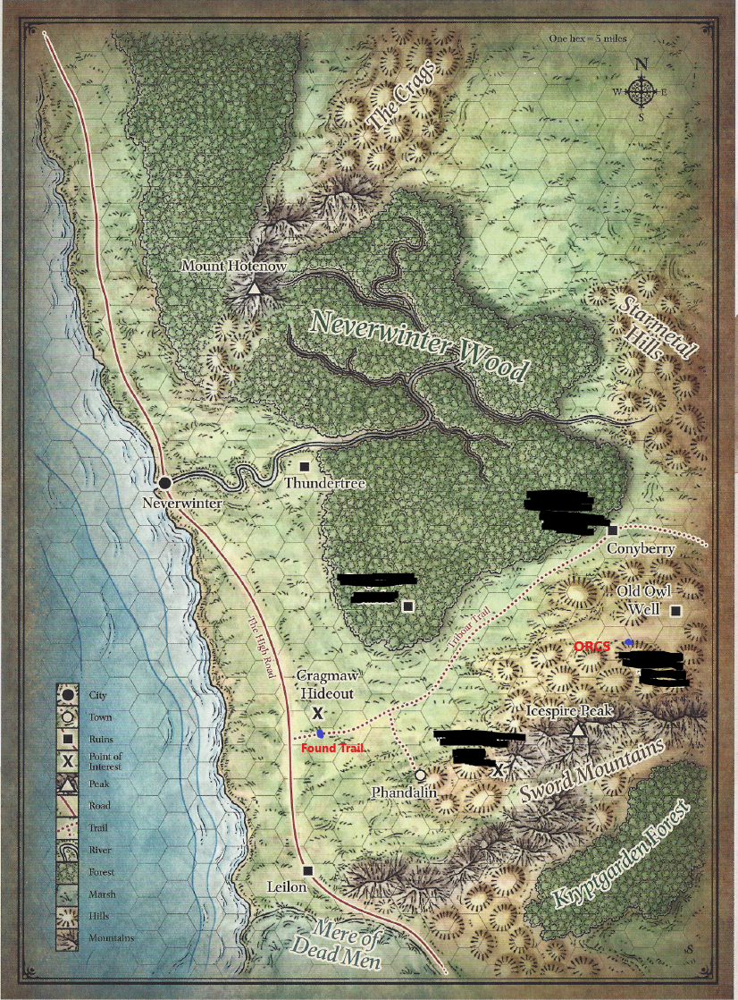
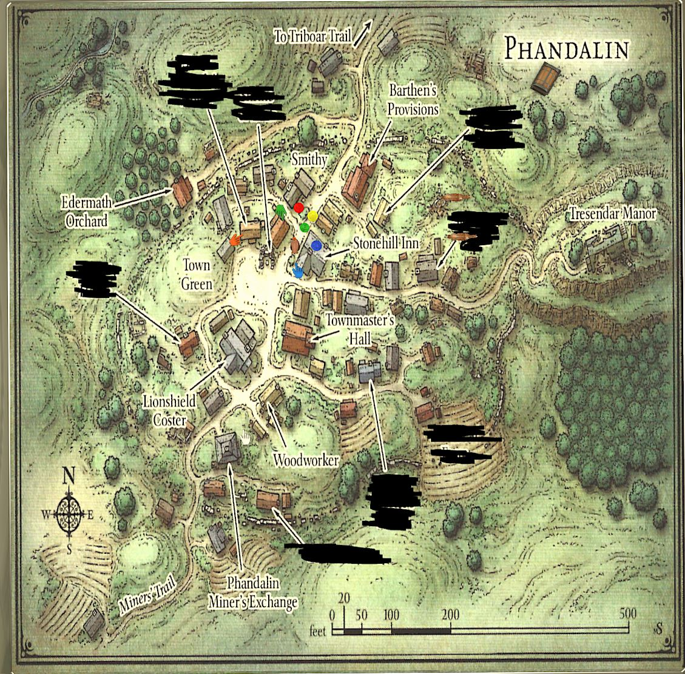

# DND TSM

## Maps

### Neverwinter

## Phandalin

The town consists of forty or fifty simple log buildings, some built on old fieldstonefoundations.
More old ruins-crumbling stone walls coveredin ivy and briars-surround the newer houses and shops,
showing how this must have been a much larger town incenturies past. Most of the newer buildings
are set on the sides of the cart track, which widens into a muddy mainstreet of sorts as it climbs
toward a ruined manor house on a hillside at the east side of town. As you approach, you see children
playing on the town greenand townsfolk tending to chores or running errands at shops. Many people
look up as you approach, but all return to their business as you go by.

## Quest

### Deliver Mining Equipment to Phandalin - Completed

- Gundren Rockseeker has hired us for 10 gold pieces to transport mining equipment to Phandalin at Barthens Provisions
  - Him and his colleagues have found something big.
  - He left a week ago with a knight to Phandalin.
    - Knights nameeer is Sildar Hallwinter.
- Gundren and his knight are missing.
- Wagon was delivered and the 10 gold pieces have been paid.

### Find Gundren Rockseeker

- Convinced Eldar to pay us 20 gold each to get Gundren back from bandits
- Has two brothers camping out east of town 10 days ago.
- Located somwhere on the Triboar Trail where we found the dead horses.

#### Progress

- Veered of Triborg Trail.
- Found two dead horses.
- We were surprised attacked by 5 goblins
- Killed all 5 goblins
- Found trail of drag marks and footsteps in the forest
  - Marked on the map
- Arrived in Phandalin
- We found Barthen's Provisions
- We found out Gunther hasn't Arrived
- Has two brothers camping out east of town 10 days ago.
- Eldar will pay us 20 gold each to get Gundren back.

## Characters

### Ventus - Rogue - Dark Elf

- Useful in combat.

### Jin - Asemar Witch

- Shot a exploding ice dagger
- Lazy, does not help in combat

### Loomi - Cleric - Bald Eagle

- Has no feathers
- Cleric to heal himself but is cursed by a Witch
  - Witch wants to
- Needs money to be stronger and find the witch

### Ametarasue - Wizard

- Cocky but reliable

## Ethel

- Learned how to make snare
